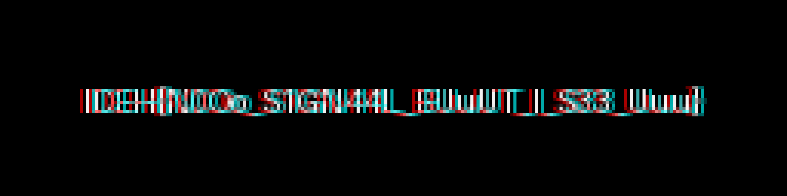

# Last Signal (last_s) - DFIR

- CTF: IDEH CTF 2026
- Category: DFIR
- Author: Unknown
- Solver: W4ST3D
- Flag: `IDEH{VR4M_D4t4_R3c0v3ry}`

---

## Challenge
> "We recovered a memory dump from a suspected compromised system's graphics card. The VRAM contains what appears to be the last rendered frame before the system was wiped.
>
> Can you reconstruct the image and find what was displayed?"

**Files:**
- `blackbox_vram.bin`: Raw VRAM dump file

---

## Overview
This challenge involves reconstructing an image from a raw VRAM (Video RAM) memory dump. The data is stored in a planar RGB format with interlaced scanning, requiring careful analysis of the memory layout to properly render the image.

---

## Root Cause
Graphics memory stores pixel data in various formats depending on the hardware. This dump uses a planar RGB format (separate R, G, B channels) with interlaced scanning (alternating even/odd scanlines) and possibly serpentine addressing (alternating row directions).

---

## Exploitation Steps

### 1. Analyze the VRAM Dump
Determine the image dimensions and format:
```python
with open('blackbox_vram.bin', 'rb') as f:
    data = f.read()

# Total bytes divided by 3 (RGB) gives pixels
plane_len = len(data) // 3
# Common resolutions: 256x64, 512x32, 64x256
```

### 2. Handle Interlaced Scanning
The data is stored with interlaced scanning (even/odd field separation):
```python
def process_plane(plane_data, width, height, field_order, serpentine_mode):
    half = len(plane_data) // 2
    part1 = plane_data[:half]
    part2 = plane_data[half:]
    
    if field_order == 'even_first':
        even_field, odd_field = part1, part2
    else:
        odd_field, even_field = part1, part2
        
    lines = []
    for i in range(height // 2):
        line_e = even_field[i*width : (i+1)*width]
        line_o = odd_field[i*width : (i+1)*width]
        
        if serpentine_mode == 'reverse_even':
            line_e = line_e[::-1]
        if serpentine_mode == 'reverse_odd':
            line_o = line_o[::-1]
            
        lines.extend([line_e, line_o])
        
    return b"".join(lines)
```

### 3. Reconstruct the Image
```python
from PIL import Image, ImageOps

width, height = 256, 64
plane_len = len(data) // 3

r_raw = data[0:plane_len]
g_raw = data[plane_len:2*plane_len]
b_raw = data[2*plane_len:3*plane_len]

# Process each channel with correct interlacing
rf = process_plane(r_raw, width, height, 'even_first', 'reverse_odd')
gf = process_plane(g_raw, width, height, 'even_first', 'reverse_odd')
bf = process_plane(b_raw, width, height, 'even_first', 'reverse_odd')

# Create image
img = Image.new('RGB', (width, height))
pixels = img.load()
for y in range(height):
    for x in range(width):
        pixels[x, y] = (rf[y*width+x], gf[y*width+x], bf[y*width+x])
```

### 4. Enhance for Readability
```python
# Scale up and auto-contrast
big = img.resize((width*8, height*8), Image.Resampling.NEAREST)
big = ImageOps.autocontrast(big)
big.save("flag_256_enhanced.png")
```

### 5. Result
The reconstructed image displays the flag: `IDEH{VR4M_D4t4_R3c0v3ry}`

   
